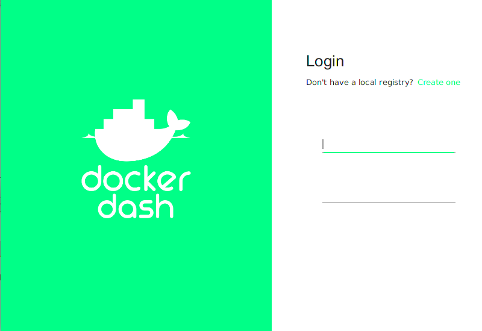
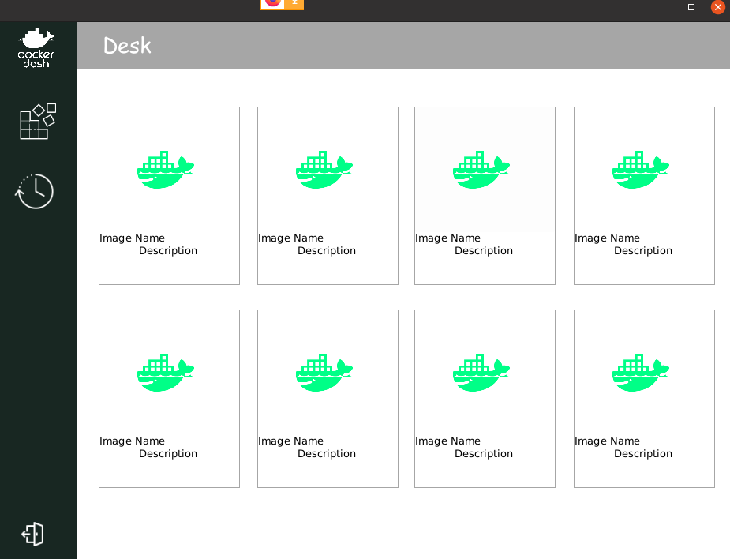

# DockerDash

DockerDash simplifies Docker container and image management with a user-friendly interface. It requires Java 8 or later and JavaFX installed on your system.

## Features

- **View Docker Repositories and Tags:** DockerDash allows you to easily view a list of Docker repositories and their tags.

- **Explore Container Details:** Gain insights into container details and manage containers efficiently.

- **Navigate Through Images:** Easily navigate through Docker images and explore their associated tags.

- **Check Docker Build History:** Explore the history of Docker builds to understand the evolution of your images.

## Usage

Ensure you have Java 8 or later and JavaFX installed on your system.

1. Clone the repository.
2. Run the DockerDash application.

## Screenshots



*login page*



*latest docker images*

## Installation

1. Install Java 8 or later.
2. Install JavaFX.
3. Clone the DockerDash repository.

## How to Run

Execute the following commands to run DockerDash:

```bash
# Navigate to the DockerDash directory
cd DockerDash

# Run the application
java -jar DockerDash.jar
